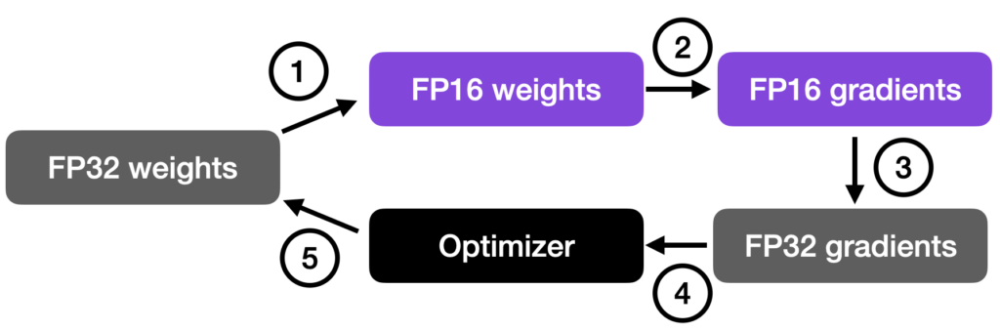

As illustrated in the figure below, mixed-precision training involves converting weights to lower-precision (FP16) for faster computation, calculating gradients, converting gradients back to higher-precision (FP32) for numerical stability, and updating the original weights with the scaled gradients.

This approach allows for efficient training while maintaining the accuracy and stability of the neural network.

1. Convert weights to FP16: In this step, the weights (or parameters) of the neural network, which are initially in FP32 format, are converted to lower-precision FP16 format. This reduces the memory footprint and allows for faster computation, as FP16 operations require less memory and can be processed more quickly by the hardware.
2. Compute gradients: The forward and backward passes of the neural network are performed using the lower-precision FP16 weights. This step calculates the gradients (partial derivatives) of the loss function with respect to the network’s weights, which are used to update the weights during the optimization process.
3. Convert gradients to FP32: After computing the gradients in FP16, they are converted back to the higher-precision FP32 format. This conversion is essential for maintaining numerical stability and avoiding issues such as vanishing or exploding gradients that can occur when using lower-precision arithmetic.
4. Multiply by learning rate and update weights: Now in FP32 format, the gradients are multiplied by a learning rate (a scalar value that determines the step size during optimization).
5. The product from step 4 is then used to update the original FP32 neural network weights. The learning rate helps control the convergence of the optimization process and is crucial for achieving good performance.