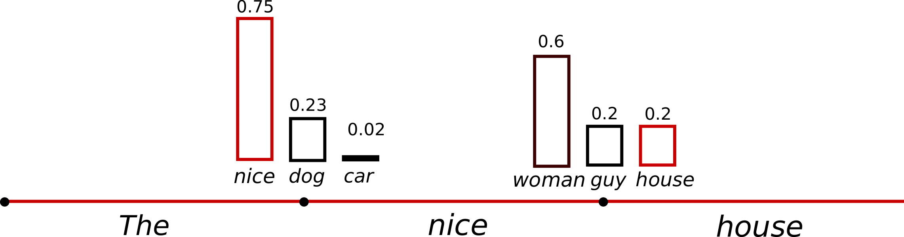

### generation主要调节参数

**max_length** (`int`, *optional*, defaults to 20) — The maximum length the generated tokens can have.

**min_length** (`int`, *optional*, defaults to 0) — The minimum length of the sequence to be generated.

**do_sample** (`bool`, *optional*, defaults to `False`) — Whether or not to use sampling (此时num_beams必须大于1); use greedy decoding otherwise.

- **top_k** (`int`, *optional*, defaults to 50) — The number of highest probability vocabulary tokens to keep for top-k-filtering.
- **top_p** (`float`, *optional*, defaults to 1.0) — If set to float < 1, only the smallest set of most probable tokens with probabilities that add up to `top_p` or higher are kept for generation.
- **temperature** (`float`, *optional*, defaults to 1.0) — The value used to modulate the next token probabilities.

$$
q_{i}=\frac{\exp \left(z_{i} / T\right)}{\sum_{j} \exp \left(z_{j} / T\right)} 
$$

* 温度T(大于1)越高,softmax分布越平缓

**num_beams** (`int`, *optional*, defaults to 1) — Number of beams for beam search. 1 means no beam search.

- **early_stopping** (`bool` or `str`, *optional*, defaults to `False`) — Controls the stopping condition for beam-based methods, like beam-search. It accepts the following values: `True`, where the generation stops as soon as there are `num_beams` complete candidates; `False`, where an heuristic is applied and the generation stops when is it very unlikely to find better candidates; `"never"`, where the beam search procedure only stops when there cannot be better candidates (canonical beam search algorithm).

**repetition_penalty** (`float`, *optional*, defaults to 1.0) — The parameter for repetition penalty. 1.0 means no penalty. See [this paper](https://arxiv.org/pdf/1909.05858.pdf) for more details.

**length_penalty** (`float`, *optional*, defaults to 1.0) — Exponential penalty to the length that is used with beam-based generation. It is applied as an exponent to the sequence length, which in turn is used to divide the score of the sequence. Since the score is the log likelihood of the sequence (i.e. negative), `length_penalty` > 0.0 promotes longer sequences, while `length_penalty` < 0.0 encourages shorter sequences.

**no_repeat_ngram_size** (`int`, *optional*, defaults to 0) — If set to int > 0, all ngrams of that size can only occur once.

### Greedy Search

Greedy search simply selects the word with the highest probability as its next word: 

$w_t= \operatorname{argmax}_w P\left(w \mid w_{1: t-1}\right)$at each timestep $t$. The following sketch shows greedy search.

Starting from the word "The", the algorithm greedily chooses the next word of highest probability "nice"and so on, so that the final generated word sequence is ("The","nice","woman") having an overall probability of $0.5 \times 0.4=0.2$ .

The major drawback of greedy search though is that it misses high probability words hidden behind a low probability word.

### Beam search

Beam search reduces the risk of missing hidden high probability word sequences by keeping the most likely `num_beams` of hypotheses at each time step and eventually choosing the hypothesis that has the overall highest probability. Let's illustrate with `num_beams=2`:

At time step 1, besides the most likely hypothesis ("The","nice"), beam search also keeps track of the second most likely one ("The","dog"). At time step 2, beam search finds that the word sequence("The","dog","has"), has with 0.36 a higher probability than ("The","nice","woman"), which has 0.2 . Great, it has found the most likely word sequence in our toy example!

Beam search will always find an output sequence with higher probability than greedy search, but is not guaranteed to find the most likely output.

### Sampling

In its most basic form, sampling means randomly picking the next word $ w_t$ according to its conditional probability distribution:

$$
w_t \sim P\left(w \mid w_{1: t-1}\right)
$$

Taking the example from above, the following graphic visualizes language generation when sampling.

word ("car") is sampled from the conditioned probability distribution $ P(w∣\text{"The"})$, followed by sampling ("drives") from $P(w∣\text{"The","car"})$ .

A trick is to make the distribution $P(w∣w_{1:t−1})$sharper (increasing the likelihood of high probability words and decreasing the likelihood of low probability words) by lowering the so-called `temperature` of the softmax.

An illustration of applying temperature to our example from above could look as follows.

The conditional next word distribution of step $t=1 $ becomes much sharper leaving almost no chance for word ("car")to be selected.

### Top-K Sampling

[Fan et. al (2018)](https://arxiv.org/pdf/1805.04833.pdf) introduced a simple, but very powerful sampling scheme, called ***Top-K*** sampling. In *Top-K* sampling, the *K* most likely next words are filtered and the probability mass is redistributed among only those *K* next words.

We extend the range of words used for both sampling steps in the example above from 3 words to 10 words to better illustrate *Top-K* sampling.

Having set $K=6$, in both sampling steps we limit our sampling pool to 6 words. While the 6 most likely words, defined as $V_{top-K}$ encompass only *ca.* two-thirds of the whole probability mass in the first step, it includes almost all of the probability mass in the second step. Nevertheless, we see that it successfully eliminates the rather weird candidates (“not",“the",“small",“told") in the second sampling step.

### Top-p (nucleus) sampling

Instead of sampling only from the most likely *K* words, in *Top-p* sampling chooses from the smallest possible set of words whose cumulative probability exceeds the probability *p*. The probability mass is then redistributed among this set of words. This way, the size of the set of words (*a.k.a* the number of words in the set) can dynamically increase and decrease according to the next word's probability distribution. 

Having set $p=0.92$, *Top-p* sampling picks the *minimum* number of words to exceed together $p=92%$of the probability mass, defined as $V_{top-p}$. In the first example, this included the 9 most likely words, whereas it only has to pick the top 3 words in the second example to exceed 92%. Quite simple actually! It can be seen that it keeps a wide range of words where the next word is arguably less predictable, *e.g.* $P(w∣\text{"The”})$, and only a few words when the next word seems more predictable, *e.g.* $P(w∣\text{"The","car"})$.