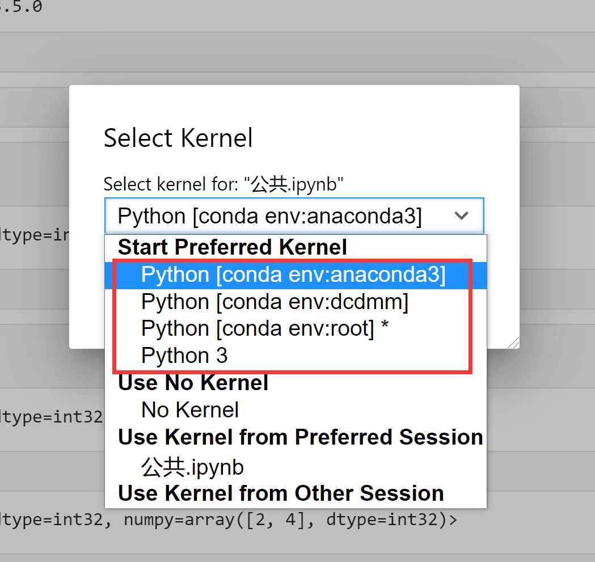

### jupyter notebook目录功能安装及其配置(base环境安装即可)

* pip install jupyter_contrib_nbextensions
* pip install jupyter_nbextensions_configurator
* jupyter contrib nbextension install --user

### 虚拟环境中安装notebook

1. 在需要jupyter notebook内核选择的环境(bash也需要)中安装jupyter notebook和支持虚拟环境的插件ipynernel
    ```shell
    pip install jupyter
    
    pip install ipykernel
    ```

2. 设置kernel, --user表示当前用户, your-env0name为虚拟环境名称
    ```shell
    python -m ipykernel install --user --name your-env0name
    ```

3. jupyter notebook使用
    1. 启动jupyter(jupyter lab --allow-root)
    2. jupyter notebook内核选择

       

### Ubunut配置远程notebook

1. 生成配置文件

    

2. 配置jupyter lab密码

    

3. 配置其他信息

       

    

4. 登录远程服务器jupyter lab

    ```shell
    jupyter lab --allow-root
    ```
5. 使用,如:
    * 浏览器:http://IP地址:8821/
    * Pycharm:http://IP地址:8821/?token=
    * Vscode:http://IP地址:8821/