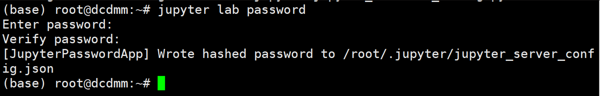
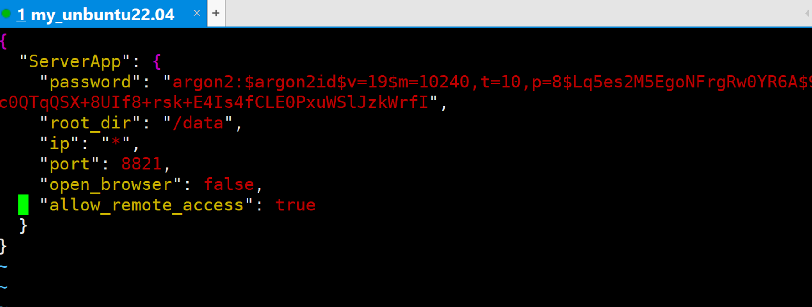

1. 下载anconda

    ```shell
    wget https://repo.anaconda.com/archive/Anaconda3-2022.10-Linux-x86_64.sh
    ```

2. 安装anconda(yes即可)

    ```shell
    bash Anaconda3-2021.05-Linux-x86_64.sh 
    ```

3. vim ~/.bashrc

    ```shell
    # 文件结尾添加下面语句
    export PATH=$PATH:/root/anaconda3/bin
    ```

4. souce ~/.bashrc

5. 生成配置文件

    

6. 配置jupyter lab密码

    

7. 配置其他信息

       

    

8. 登录远程服务器jupyter lab

    ```shell
    jupyter lab --allow-root
    ```

9. 默认pip设置为anaconda自带的pip(通过pip -V查看当前环境使用的python版本)

    ```shell
    # 备份原有软链接**
    
    mv /usr/bin/pip  /usr/bin/pip.back
    
    mv /usr/local/bin/pip /usr/local/bin/pip.back
    
    # 设置新的软链接
    
    ln -s /root/anaconda3/bin/pip** **/****usr/local/bin
    ```

10. 使用,如:
    * 浏览器:http://IP地址:8821/
    * Pycharm:http://IP地址:8821/?token=
    * Vscode:http://IP地址:8821/