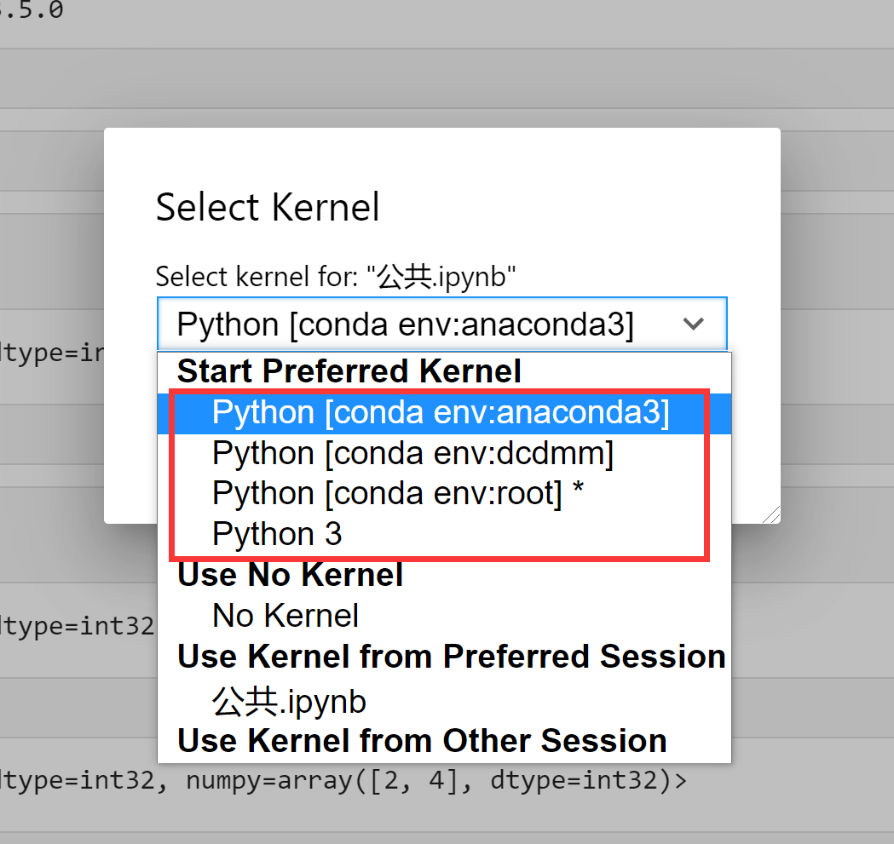

1. 创建虚拟环境
    ```shell
    conda create -n your_env_name python=3.7.1
    ```

2. 更新bashrc中的环境变量
    ```shell
    # Linux
    conda init bash && source 用户目录/.bashrc
    
    # Windows
    conda init bash
    ```

3. 进入虚拟环境
    ```shell
    conda activate your_env_name
    ```

4. 在需要内核选择的环境(bash也需要)中安装jupyter notebook和支持虚拟环境的插件nb_conda
    ```shell
    pip install jupyter notebook
    
    conda install nb_conda_kernels
    ```

5. 设置kernel, --user表示当前用户, your env name为虚拟环境名称
    ```shell
    ipython kernel install --user --name=you-env-name
    ```
   
6. jupyter notebook使用
   1. 进入其中一个虚拟环境启动jupyter(jupyter lab --allow-root)并退出(crtl + z)(仅第一次使用时需要一次)
   2. base环境中启动jupyter
   3. jupyter notebook内核选择
   
      

### 常见命令

```shell
# 查看当前存在的虚拟环境
conda env list

# 关闭虚拟环境(该虚拟环境中)
conda deactivate

# 删除某个虚拟环境
conda remove -n your_env_name --all
```